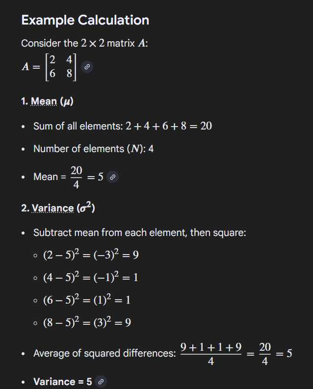
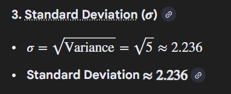

# Lesson 2.2: Array Operations and Broadcasting

## Broadcasting

**Broadcasting** = NumPy's way to operate on arrays of different shapes

```python
import numpy as np

# Scalar broadcasting
arr = np.array([1, 2, 3, 4])
result = arr + 10  # 10 is "broadcast" to [10, 10, 10, 10]
print(result)  # [11 12 13 14]

# 1D + 2D broadcasting
matrix = np.array([[1, 2, 3], [4, 5, 6]])
vector = np.array([10, 20, 30])
result = matrix + vector
# vector broadcasts to each row:
# [[1, 2, 3],     [[10, 20, 30],     [[11, 22, 33],
#  [4, 5, 6]]  +   [10, 20, 30]]  =   [14, 25, 36]]
print(result)

# Column vector broadcasting
col = np.array([[10], [20]])  # 2x1
result = matrix + col
# [[1, 2, 3],     [[10],     [[11, 12, 13],
#  [4, 5, 6]]  +   [20]]  =   [24, 25, 26]]
```

**Why broadcasting matters for neural networks:**

- Adding bias to all neurons at once
- Normalizing data efficiently
- Fast computations

## Universal Functions (ufuncs)

```python
arr = np.array([1, 2, 3, 4, 5])

# Math functions
print(np.sqrt(arr))    # Square root
print(np.exp(arr))     # e^x
print(np.log(arr))     # Natural log
print(np.sin(arr))     # Sine
print(np.abs(arr))     # Absolute value

# These work element-wise and are FAST!
```

## Matrix Operations

### Dot Product

```python
# 1D dot product
a = np.array([1, 2, 3])
b = np.array([4, 5, 6])
dot = np.dot(a, b)  # 1*4 + 2*5 + 3*6 = 32
print(dot)

# Or use @ operator
dot = a @ b  # Same as np.dot(a, b)

# Matrix multiplication ==> Where row are multiply by columns.
A = np.array([[1, 2], [3, 4]])
B = np.array([[5, 6], [7, 8]])
result = A @ B
# [[1*5+2*7, 1*6+2*8],   [[19, 22],
#  [3*5+4*7, 3*6+4*8]] =  [43, 50]]
print(result)
```

**IMPORTANT:** `*` vs `@`

```python
A = np.array([[1, 2], [3, 4]])
B = np.array([[5, 6], [7, 8]])

print(A * B)   # Element-wise: [[5, 12], [21, 32]]
print(A @ B)   # Matrix mult: [[19, 22], [43, 50]]
```

### Transpose

```python
matrix = np.array([[1, 2, 3], [4, 5, 6]])
# [[1, 2, 3],
#  [4, 5, 6]]

transposed = matrix.T
# [[1, 4],
#  [2, 5],
#  [3, 6]]
```

## Aggregation Functions

```python
arr = np.array([[1, 2, 3], [4, 5, 6]])

# Overall
print(arr.sum())    # 21
print(arr.mean())   # 3.5
print(arr.std())    # 1.7 Standard deviation
print(arr.var())    # 2.91 Variance

# Axis operations
print(arr.sum(axis=0))   # [5, 7, 9] - column sums
print(arr.sum(axis=1))   # [6, 15] - row sums
print(arr.mean(axis=0))  # [2.5, 3.5, 4.5]

# Cumulative
arr = np.array([1, 2, 3, 4])
print(np.cumsum(arr))  # [ 1  3  6 10] - cumulative sum


```





## Stacking and Splitting

```python
a = np.array([1, 2, 3])
b = np.array([4, 5, 6])

# Vertical stack
v = np.vstack([a, b])
# [[1, 2, 3],
#  [4, 5, 6]]

# Horizontal stack
h = np.hstack([a, b])
# [1, 2, 3, 4, 5, 6]

# Concatenate
c = np.concatenate([a, b])
# [1, 2, 3, 4, 5, 6]

# Split
arr = np.arange(9)
parts = np.split(arr, 3)  # Split into 3 parts
# [array([0, 1, 2]), array([3, 4, 5]), array([6, 7, 8])]
```

## Random Numbers (Important for ML!)

```python
# Set seed for reproducibility
np.random.seed(42)

# Random floats [0, 1)
rand = np.random.rand(3, 3)

# Random integers
randint = np.random.randint(0, 10, size=5)  # 5 random ints

# Normal distribution (mean=0, std=1)
normal = np.random.randn(1000)

# Random choice
choice = np.random.choice([1, 2, 3, 4, 5], size=3)

# Shuffle
arr = np.arange(10)
np.random.shuffle(arr)
```

## Practical Example: Neural Network Weight Init

```python
# Initialize weights for a neural network layer
# Input: 784 neurons (28x28 image)
# Output: 128 neurons

# Random initialization (simple but not optimal)
weights = np.random.randn(784, 128) * 0.01    # 748 rows & 128 columns martics with random data
bias = np.zeros(128)

print(f"Weights shape: {weights.shape}")  # (784, 128)
print(f"Bias shape: {bias.shape}")        # (128,)

# Simulate forward pass
input_data = np.random.randn(1, 784)  # 1 sample, 784 features
output = input_data @ weights + bias   # Broadcasting!
print(f"Output shape: {output.shape}")  # (1, 128)
```

## Performance Comparison

```python
import time

# Python list (slow)
python_list = list(range(1000000))
start = time.time()
result = [x * 2 for x in python_list]
print(f"List: {time.time() - start:.4f}s")

# NumPy (fast!)
numpy_array = np.arange(1000000)
start = time.time()
result = numpy_array * 2
print(f"NumPy: {time.time() - start:.4f}s")

# NumPy is 10-100x faster!
```

## Practice

```python
import numpy as np

# 1. Broadcasting
matrix = np.array([[1, 2, 3], [4, 5, 6], [7, 8, 9]])
row = np.array([10, 20, 30])
print(matrix + row)

# 2. Matrix multiplication
A = np.array([[1, 2], [3, 4]])
B = np.array([[5, 6], [7, 8]])
print(A @ B)

# 3. Transpose
print(matrix.T)

# 4. Statistics
data = np.random.randn(100, 5)  # 100 samples, 5 features
print(f"Mean: {data.mean(axis=0)}")
print(f"Std: {data.std(axis=0)}")

# 5. Boolean operations
scores = np.array([85, 92, 78, 95, 88])
passed = scores >= 80
print(f"Pass rate: {passed.mean() * 100}%")

# 6. Dot product
v1 = np.array([1, 2, 3])
v2 = np.array([4, 5, 6])
print(f"Dot product: {v1 @ v2}")
```

## 💡 Key Points

- Broadcasting = operations on different shapes
- `@` for matrix multiplication, `*` for element-wise
- `.T` for transpose
- `axis=0` (columns), `axis=1` (rows)
- NumPy is 10-100x faster than Python lists

**Next:** `03_linear_algebra.md`
